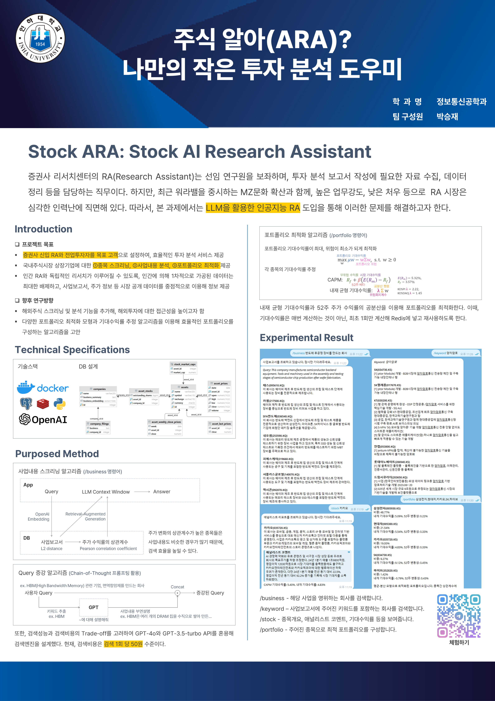

# Stock ARA

> Stock AI Research Assistant


Stock ARA(AI Research Assistant) is an innovative stock screening and portfolio optimization system that leverages a Large Language Model(LLM) and Retrieval-Augmented Generation(RAG).



This is an official implementation of the paper: **A Novel Stock Screening Approach using Large Language Models and Correlation-Aware Retrieval**.

## Key Features

- Advanced stock screening using LLM and RAG
- User query augmentation for improved search accuracy
- Correlation-aware retrieval combining business report similarity and stock return correlation
- Portfolio optimization based on the Mean-Variance model and Black-Litterman approach
- Cost-efficient use of GPT-3.5 and GPT-4 APIs

## Get Started

### Technical Specifications

- [Python](https://www.python.org/)
- [OpenAI GPT API](https://platform.openai.com/) (GPT-3.5 and GPT-4o)
- [PostgreSQL](https://www.postgresql.org/) with [pgvector](https://github.com/pgvector/pgvector) and [Timescale](https://www.timescale.com/)
- [Redis](https://redis.io/)
- [Docker](https://hub.docker.com/)

### Data Sources

- KRX listed stock information from [KRX Market Data System](http://data.krx.co.kr/contents/MDC/MDI/mdiLoader/index.cmd?menuId=MDC0201020201)
- Business reports from [DART](https://dart.fss.or.kr/)
- Stock price data from [Yahoo Finance](https://finance.yahoo.com/)

### Usage

1. Clone the repository

    ```txt
    $ git clone https://github.com/Astro36/stock-ara.git
    ```

2. Set up the required environment variables: [.env](.env.example)
   
   - `APP_ID`: app name, used in database (ex. `demo`)
   - `POSTGRES_PASSWORD`: user password for PostgreSQL
   - `OPENAI_API_KEY`: see [OpenAI API Key](https://platform.openai.com/account/api-keys)
   - `OPENDART_API_KEY`: see [Open DART API Key](https://opendart.fss.or.kr/mng/userApiKeyListView.do) (optional)
   - `TELEGRAM_BOT_TOKEN`: see [Telegram BotFather](https://t.me/botfather)

3. Load stock data and business reports into the database
4. Update stock price data
5. Run docker compose

    ```txt
    $ docker compose up
    ```